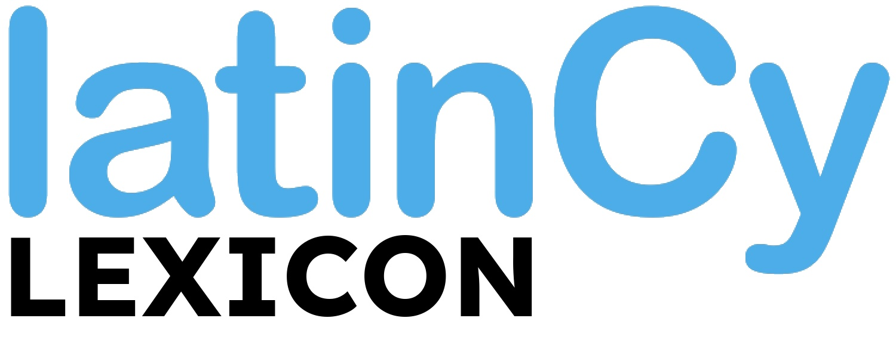

<p align="center">
  
</p>

# LatinCy Lexicon

**Whitaker's Words as LatinCy pipeline components for Latin NLP.**

`latincy-lexicon` makes the lexical data and morphological analysis engine from [Whitaker's Words](https://mk270.github.io/whitakers-words/) available as spaCy pipeline components, designed for use with [LatinCy](https://huggingface.co/latincy) language models.

## Quick Start

```python
import spacy

nlp = spacy.load("la_core_web_lg")
nlp.add_pipe("whitakers_words", config={
    "lexicon_path": "data/json/lexicon.json",
    "analyzer_path": "data/json/analyzer.json",
})
nlp.add_pipe("paradigm_generator", config={
    "analyzer_path": "data/json/analyzer.json",
})

doc = nlp("Poeta bonus carmina pulchra scribit.")

# Dictionary glosses
for token in doc:
    if token._.gloss:
        print(f"{token.text:12} {token._.gloss}")
# Poeta        poet
# bonus        good, honest, brave, noble, kind, pleasant, right
# carmina      song, poem
# pulchra      pretty, beautiful, handsome, noble, illustrious
# scribit      write

# Reinflection: change morphological features, get the right Latin form
scribit = doc[4]
print(scribit._.reinflect(Number="Plur"))    # scribunt
print(scribit._.reinflect(Tense="Imp"))      # scribebat
print(scribit._.reinflect(Voice="Pass"))     # scribitur
```

## Features

- **`whitakers_words`** — Single pipeline component providing dictionary glosses (`token._.lexicon`), rule-based morphological analysis (`token._.ww`), and short definitions (`token._.gloss`)
- **`paradigm_generator`** — Generates complete inflectional paradigms for any lemma, with reinflection support (`token._.paradigm`, `token._.reinflect`)
- **Standalone `Generator` API** — Produce all inflected forms for a lemma, or build form-to-lemma lookup tables, without requiring spaCy
- **POS-aware ranking** — Uses upstream tagger/morphologizer output to rank ambiguous entries and parses
- **Multi-signal disambiguation** — Scores candidates using lemma match, morphological features, dependency labels, NER context, and dictionary frequency

## Installation

```bash
pip install latincy-lexicon
```

Or for development:

```bash
git clone https://github.com/latincy/latincy-lexicon.git
cd latincy-lexicon
uv venv && source .venv/bin/activate
uv pip install -e ".[dev,spacy]"
```

## Data Setup

The Whitaker's Words data files are bundled in the package. Build the JSON data files with a single command:

```bash
latincy-lexicon build
```

This parses the bundled DICTLINE, INFLECTS, UNIQUES, and ADDONS files, applies patches (sum/esse, pronoun endings), reconstructs headwords, and writes `analyzer.json` and `lexicon.json` to `data/json/`.

## Usage

```python
import spacy

nlp = spacy.load("la_core_web_lg")

# Add Whitaker's Words (lexicon + analyzer in one component)
nlp.add_pipe("whitakers_words", config={
    "lexicon_path": "data/json/lexicon.json",
    "analyzer_path": "data/json/analyzer.json",
})

doc = nlp("Gallia est omnis divisa in partes tres.")

for token in doc:
    print(f"{token.text:12} {token._.gloss}")
```

## Pipeline Components

### `whitakers_words`

A single component that provides three token extensions:

- `token._.lexicon` — list of dictionary entries matching the token's lemma, with glosses, part of speech, principal parts, and age/frequency metadata
- `token._.ww` — full morphological parse list from the Words stem+ending engine, ranked by POS match, morphological features, dependency labels, NER context, and frequency
- `token._.gloss` — short definition from the top-ranked parse

Either data path is optional: pass only `lexicon_path` for dictionary lookups, only `analyzer_path` for morphological analysis, or both. Best results when placed after all LatinCy pipeline components.

### `paradigm_generator`

Generates complete inflectional paradigms for Latin words. The inverse of the analyzer: given a lemma, it produces all inflected forms with UD morphological features.

```python
nlp.add_pipe("paradigm_generator", config={
    "analyzer_path": "data/json/analyzer.json",
})

doc = nlp("Amat puellam.")
for token in doc:
    if token._.paradigm:
        print(f"{token.text}: {len(token._.paradigm)} forms")
```

Token extensions:

- `token._.paradigm` — list of all inflected forms for the token's lemma, each with `form`, `lemma`, `upos`, and `feats` (dict of UD features). `None` for punctuation or unknown lemmas.
- `token._.reinflect(**overrides)` — returns a surface form matching the token's current morphology merged with the provided UD feature overrides, or `None` if no match exists.

```python
doc = nlp("amat")
doc[0]._.reinflect(Number="Plur")           # "amant"
doc[0]._.reinflect(Tense="Imp")             # "amabat"
doc[0]._.reinflect(Tense="Imp", Number="Plur")  # "amabant"
```

### Standalone Generator API

The `Generator` class can be used independently of spaCy:

```python
from latincy_lexicon.generator import Generator

gen = Generator.from_json("data/json/analyzer.json")

# Generate all forms of a lemma
forms = gen.generate("amo")              # all forms of "amo"
forms = gen.generate("rex", pos="N")     # noun forms only

for f in forms[:5]:
    print(f"{f.form:15} {f.upos:6} {f.feats}")
# amo             VERB   Mood=Ind|Number=Sing|Person=1|Tense=Pres|VerbForm=Fin|Voice=Act
# amas            VERB   Mood=Ind|Number=Sing|Person=2|Tense=Pres|VerbForm=Fin|Voice=Act
# amat            VERB   Mood=Ind|Number=Sing|Person=3|Tense=Pres|VerbForm=Fin|Voice=Act
# amamus          VERB   Mood=Ind|Number=Plur|Person=1|Tense=Pres|VerbForm=Fin|Voice=Act
# amatis          VERB   Mood=Ind|Number=Plur|Person=2|Tense=Pres|VerbForm=Fin|Voice=Act

# Build form→lemma lookup tables for batch processing
lookup = gen.to_lookup_dict(["rex", "puella"])
# {"rex": "rex", "regis": "rex", "regi": "rex", ..., "puella": "puella", ...}
```

Each `Form` has four fields: `form` (surface), `lemma` (citation), `upos` (UD POS), and `feats` (UD feature string).

## Acknowledgments

This project is built on [**Whitaker's Words**](https://mk270.github.io/whitakers-words/), a Latin dictionary and morphological analysis program created by Colonel William A. Whitaker (USAF, Retired). The WORDS system — including its lexicon (DICTLINE), inflection tables (INFLECTS), and morphological analysis logic — is the foundation of `latincy-lexicon`. Whitaker made all parts of the WORDS system freely available for any purpose ("Permission is hereby freely given for any and all use of program and data.", cf. [here](https://mk270.github.io/whitakers-words/introduction.html)); this project exists because of that generosity. 

The WORDS data files used by this project are maintained at [mk270/whitakers-words](https://github.com/mk270/whitakers-words). Thank you to [Martin Keegan](https://mk270.github.io/whitakers-words/plan.html) for continuing Whitaker's work and sharing that work in the same spirit.

## License

The original Python code in this project is released under the [MIT License](LICENSE).

The Whitaker's Words data and analysis logic incorporated in this project are copyright William A. Whitaker (1936–2010) and distributed under his original permissive license (see [LICENSE](LICENSE) for full text).
